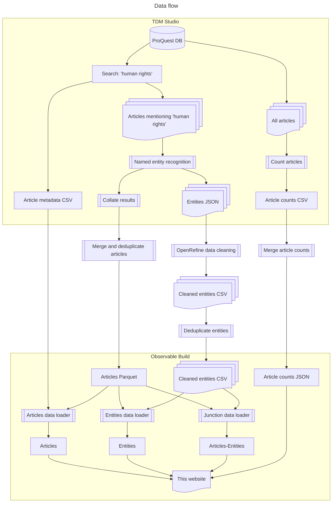

```js
import { version }  from './components/queries.js';

```
<div class="hero">
  <h1>Human Rights in News Articles</h1>
  <h2>${version}</h2>

</div>

<div class="grid grid-cols-1">

<div class="card">





</div>


</div>

<style>

h1 {
  font-family: sans-serif
}

.hero h2 {
}


</style>
